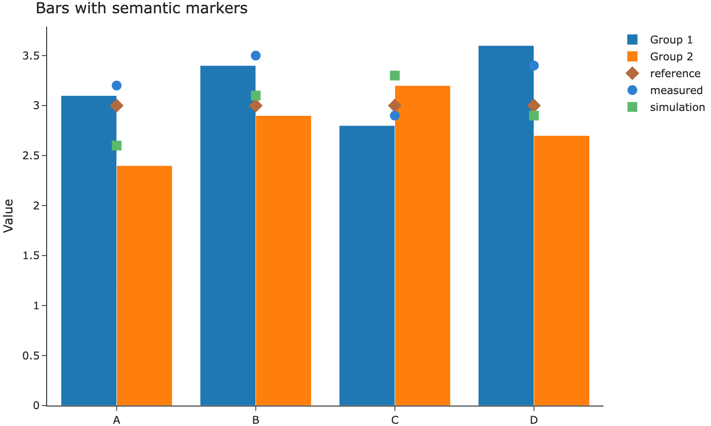

These components render with Quarto's own layout. The Kit does not yet restyle
them. They are here so that choice can be reviewed.

## Columns

::: {.columns}
::: {.column width="50%"}
The left column is half of the content measure.
:::

::: {.column width="50%"}
The right column is the other half. A narrow screen stacks them.
:::
:::

## Tabset

::: {.panel-tabset}
## First

A tab is a Quarto panel, not a Kit component.

## Second

The second panel stays in the same article width.
:::

## Image

Images in this document come from the Plotly Design Kit. The chart below is
its bars-and-markers figure, saved here as a static image. Quarto's folded
cell keeps the embed source behind Source and shows the image underneath.

```{python}
#| code-fold: true
#| code-summary: "Source"
from IPython.display import Image
Image("images/bars-semantic-markers.png")
```

A page that only needs the picture, without a source disclosure, embeds it
directly:

```markdown

```

## Theme toggle

Quarto keeps two outputs from one cell and shows one of them. `body.quarto-dark` hides `.light-content`; `body.quarto-light` hides `.dark-content`. The Kit's dark stylesheet is marked `data-mode="dark"`, so the header toggle adds and removes `quarto-dark` with the stylesheet.

Emit the light output first, then the dark output:

```{python}
#| renderings: [light, dark]
#| code-fold: true
#| code-summary: "Source"
from IPython.display import HTML, display

def swatch(background, foreground, label):
    display(HTML(
        f'<p style="margin:0;padding:1rem 1.25rem;background:{background};color:{foreground}">{label}</p>'
    ))

swatch("#faf8f8", "#2b2b2b", "Light rendering")
swatch("#161618", "#ebebec", "Dark rendering")
```

The same order works for a Plotly figure: draw the light figure, then the dark figure, under `#| renderings: [light, dark]`. The figure colors are baked into each output. The toggle does not recolor a single picture.

## Diagram

```{mermaid}
flowchart LR
  Areas[Areas] --> Pages[Page List]
  Pages --> Article[Article]
  Article --> Sections[Section List]
```

The diagram above is the figure sample. This gallery does not ship a photograph.

## Limits

The theme contains columns, a tabset, and this diagram inside the article
width. A figure wider than the measure, or one whose labels are unreadably
small, should be redrawn. Do not shrink the type to force a poster into the
column.
